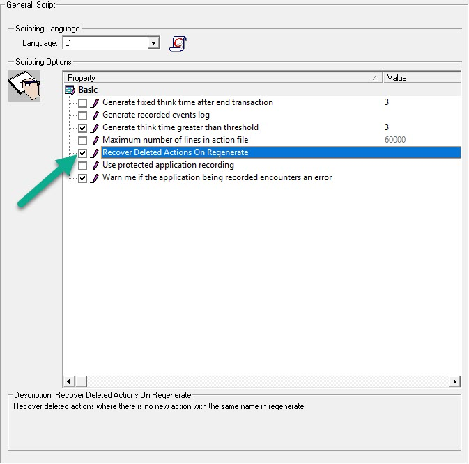
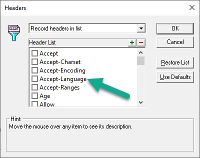

# Regenerate Script

**00. How to regenerate script in VuGen?**

Click here to view the hint/answer

 

Take a back up of the script, then go to <b>Record > Regenerate Script</b> or press <kbd>Ctrl+Shift+R</kbd>.

 

**10. How to convert from C to JavaScript without recording it again?**

Click here to view the hint/answer

 

Open the desired script, press <kbd>Ctrl+Shift+R</kbd>, click on <b>Options</b>, under <b>General > Script</b>, select <b>JavaScript</b> and then click on OK.

 

**20. How to recover deleted Actions on regenerate?**

Click here to view the hint/answer

 

Open the desired script, press <kbd>Ctrl+Shift+R</kbd>, click on <b>Options</b>, under <b>General > Script</b>, select <b>JavaScript</b> and then click on OK.

 

**30. How to exclude `Accept-Language` header from the script after recording?**

Click here to view the hint/answer

 

Open the desired script, press <kbd>Ctrl+Shift+R</kbd>, click on <b>Options</b>, under <b>HTTP Properties > Advanced</b>, click on<b>Headers</b>, select Record headers in list and then uncheck Accept-Language and then click on OK twice.

 