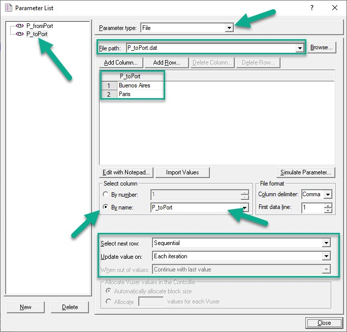
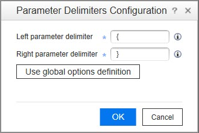

**00. In how many ways you can bring up Parameter List options?**
<details><summary>Click here to view the hint/answer</summary>
<br/>
<p>
<ol>
<li>by pressing <kbd>Ctrl + L</kbd></li>
<li>by right-clicking on the value > Replace with Parameter > Create New Parameter</li>
<li>from the menu `Design > Parameters > Create New Parameter`</kbd></li>

</ol>
</p>

</details><br/>

**10. How to create a new parameter quickly?**
<details><summary>Click here to view the hint/answer</summary>
<br/>
<p>

By pressing <kbd>Ctrl + K</kbd>.

</p>

</details><br/>


**20. What is the default parameter type?**
<details><summary>Click here to view the hint/answer</summary>
<br/>
<p>

File type.

</p>

</details><br/>

**30. How to parameterize `fromPort` and `toPort` from BlazeDemo transactions?**
<details><summary>Click here to view the hint/answer</summary>
<br/>
<p>
<ol>
<li>Fire up Parameter List by pressing <kbd>Ctrl + L</kbd></li>
<li>Create two parameters of File type each for fromPort and to Port</li>
<li>Add the values by clicking on `Edit with Notepad` for fromPort and toPort respectively, and then click on Close</li>
<li>Go to the script, select the values of fromPort/toPort, right click > Replace with Parameter > select the variable name fromPort/toPort.</li>

</p>



</details><br/>

**40. How to revert to original value after parameterization?**
<details><summary>Click here to view the hint/answer</summary>
<br/>
<p>
Right click on the parameter > Restore Original Value.
</p>

</details><br/>

**50. How to create random number parameter?**
<details><summary>Click here to view the hint/answer</summary>
<br/>
<p>
In Parameter List, select `Random Number` parameter type as shown below.
</p>


</details><br/>

**60. How to change Parameter Delimiter Configuration?**
<details><summary>Click here to view the hint/answer</summary>
<br/>
<p>
Fire up Parameter Delimiter Configuration by pressing <kbd>Ctrl + B</kbd>

</p>


</details><br/>

**70. How to send yesterday's date in VuGen?**
<details><summary>Click here to view the hint/answer</summary>
<br/>
<p>
Use the below configuration while creating a Date/Time parameter for yesterday's date.
</p>


To validate, add the below code.

```
	lr_log_message(lr_eval_string("{P_Date}"));
```
</details><br/>

**80. How to select `Same line as` option in Parameter List?**
<details><summary>Click here to view the hint/answer</summary>
<br/>
<p>
`Same line as` option will appear if you have more than one columns and would like to select the respective row's data.
</p>


</details><br/>

**90. How to delete parameter files from the disk?**
<details><summary>Click here to view the hint/answer</summary>
<br/>
<p>
Right click on the desired parameter to delete > Delete, check `Delete parameter data file from disk` as shown below and then click on OK. 

This will delete the parameter file form the disk which is irreversible.
</p>


</details><br/>

**100. How to advance to the next available parameter in runtime?**
<details><summary>Click here to view the hint/answer</summary>
<br/>
<p>
Add lr_advance_param("Parameter-Name") just before the function call which will retrieve the next available parameter in runtime.
</p>

</details><br/>

**110. How to advance to the next row runtime?**
<details><summary>Click here to view the hint/answer</summary>
<br/>
<p>
Add lr_next_row("Parameter-File.data") just before the function call which will retrieve the next row in runtime.
</p>

</details><br/>