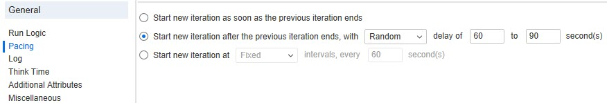

# Pacing

> Pacing enables you to control the time between iterations. The pace tells the Vuser how long to wait between iterations of your actions.

**00. Where to configure Pacing setting?**

Click here to view the hint/answer

 

Go to Replay > Runtime Settings > General > Pacing.

 

**10. Which option you will select to configure the iteration at predefined fixed/random interval?**

Click here to view the hint/answer

 

 

**20. Which option you will select to configure the random pacing after the previous iteration ends?**

Click here to view the hint/answer

 

 

**30. How to edit pacing settings from the config file?**

Click here to view the hint/answer

 

Go to the desired script folder, open `default.usp` file and edit the settings under `[RunLogicRunRoot]`.

 

**40. How to change the pacing type in default.usp?**

Click here to view the hint/answer

 

Go to the desired script folder, open `default.usp` file and edit the pacing type under `[RunLogicPaceType]`.

<pre>
|   RunLogicPaceType    |
|   ----------------    |
|   ASAP                |
|   Const               |
|   Random              |
|   ConstAfter          |
|   After               |
</pre>

 

