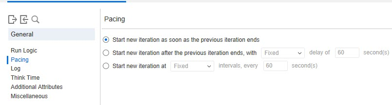
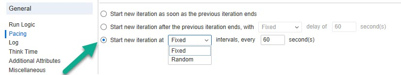

# Pacing

> Pacing enables you to control the time between iterations. The pace tells the Vuser how long to wait between iterations of your actions.

**00. Where to configure Pacing setting?**

Click here to view the hint/answer

 

Go to Replay > Runtime Settings > General > Pacing.

 

**10. Which option you will select to configure the iteration at predefined fixed/random interval?**

Click here to view the hint/answer

 

 

**20. Which option you will select to configure the random pacing after the previous iteration ends?**

Click here to view the hint/answer

 

 

**30. Which option you will select to configure the random pacing after the previous iteration ends?**

Click here to view the hint/answer

 

 