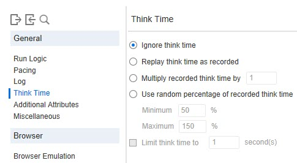
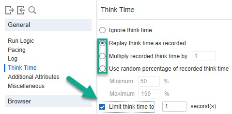
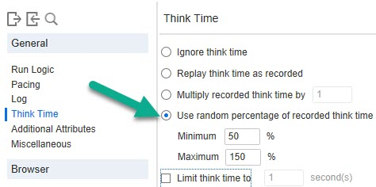

# Think Time

> I have a joke about LoadRunner, but my think time is too high :)

> Think Time enables you to configure the think time settings, controlling the time that a Vuser waits between actions. This helps emulate a real user.

**00. Where to configure Think Time setting?**
<details><summary>Click here to view the hint/answer</summary>
<br/>
<p>
Go to Replay > Runtime Settings > General > Think Time.
</p>



</details><br/>

**10. How to limit think time?**
<details><summary>Click here to view the hint/answer</summary>
<br/>
<p>
Go to Replay > Runtime Settings > General > Think Time, select any radio button option except Ignore think time and then check `Limit think time to` checkbox.
</p>



</details><br/>

**20. How to apply think time programmatically for 10 seconds?**
<details><summary>Click here to view the hint/answer</summary>
<br/>

```
	lr_think_time(10);

```

</details><br/>

**30. How to apply random think time?**
<details><summary>Click here to view the hint/answer</summary>
<br/>
<p>
Go to Replay > Runtime Settings > General > Think Time, select `Use random percentage of recorded think time` option.
</p>



</details><br/>

**40. How to configure think time in config file?**
<details><summary>Click here to view the hint/answer</summary>
<br/>
<p>
Go to the desired script folder, open `default.cfg` file and edit the settings under `[ThinkTime]`.
</p>

</details><br/>