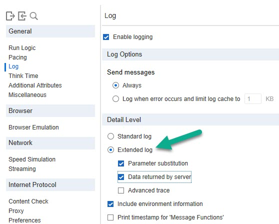
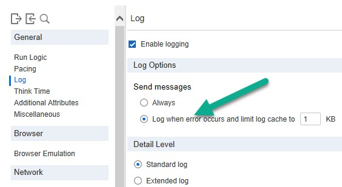

# Logging

> Log enables you to configure the amount and types of information that are recorded in the log.

**00. How to enable extended log?**
<details><summary>Click here to view the hint/answer</summary>
<br/>
<p>
Go to Replay > Runtime Settings > General > Log, select `Extended Log` as shown below.
</p>



</details><br/> 

**10. How to enable extended log programmatically?**
<details><summary>Click here to view the hint/answer</summary>
<br/>
<p>

```
	lr_set_debug_message(LR_MSG_CLASS_EXTENDED_LOG, LR_SWITCH_ON );

```

</p>

</details><br/> 

**20. How to disable log programmatically?**
<details><summary>Click here to view the hint/answer</summary>
<br/>
<p>

```
	lr_set_debug_message(LR_MSG_CLASS_DISABLE_LOG,LR_SWITCH_ON);

```

</p>

</details><br/> 

**30. How to send log when error occurs?**
<details><summary>Click here to view the hint/answer</summary>
<br/>
<p>



</p>

</details><br/> 

**40. If the script is functional, the best practice is to turn off the logging? True or False**
<details><summary>Click here to view the hint/answer</summary>
<br/>
<p>
True. Logging conserve resources, once you gain the confidence of the scripts, it is best to turn off the logs.
</p>

</details><br/> 
