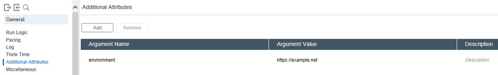

# Additional Attributes

**00. How to add additional argument name and value to the script?**
<details><summary>Click here to view the hint/answer</summary>
<br/>
<p>
Go to `Replay > Runtime Settings > General > Additional Attributes`, click on `Add` to add additional attributes as shown below.
</p>



</details><br/> 

**10. How to make use of additional attributes to pass URL in the VuGen script?**
<details><summary>Click here to view the hint/answer</summary>
<br/>
<p>
Refer the `00` question screenshot for reference. In the Action, you can add the below code which will take the value from the additional attributes runtime.

About [LPCSTR](https://docs.microsoft.com/en-us/openspecs/windows_protocols/ms-dtyp/f8d4fe46-6be8-44c9-8823-615a21d17a61).

```
LPCSTR server;
	
	web_set_sockets_option("SSL_VERSION", "AUTO");
	
	server=lr_get_attrib_string("environment");
	
	lr_save_string(server, "URL");
	
	web_url("{URL}", 
		"URL={URL}", 
		"Resource=0", 
		"RecContentType=text/html", 
		"Referer=", 
		"Snapshot=t1.inf", 
		"Mode=HTML", 
		EXTRARES, 
		"Url=/favicon.ico", ENDITEM, 
		LAST);

```
</p>


</details><br/> 

**20. How to add additional argument name and value in the config file?**
<details><summary>Click here to view the hint/answer</summary>
<br/>
<p>
Go to the desired script folder, open `default.cfg` file and add the argument value and value under  `[CommandArguments]`.

```
    [CommandArguments]
    ~environment=
    ~username=
    environment=https://example.com
    username=admin

```

</p>


</details><br/> 