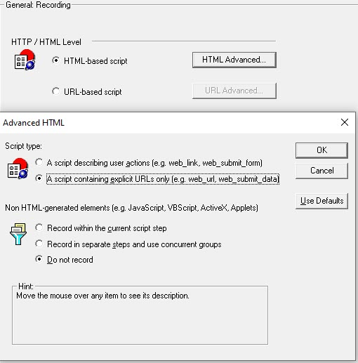
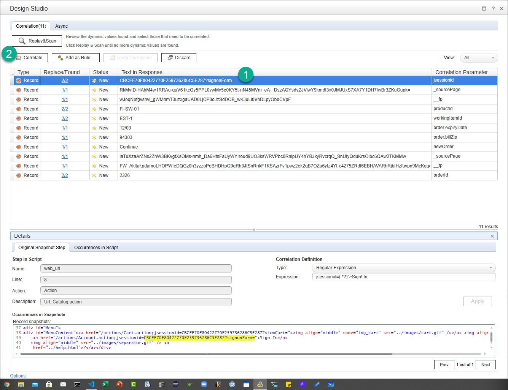

# Auto Correlation

For below exercises, please record the Pet Store business flow using the below settings.

* Browser: Internet Explorer
* Recording Options
* Create an account at [https://petstore.octoperf.com/actions/Catalog.action](https://petstore.octoperf.com/actions/Catalog.action)

|   **Steps to record**   | **Transaction Name**  |
|   ---------------   | ----------------  |
|   Launch [https://petstore.octoperf.com/actions/Catalog.action](https://petstore.octoperf.com/actions/Catalog.action)   |   T00_Launch  |
|   Click on Sign In   |   T10_SignIn |
|   Enter Username and Password and then click on `Login` |   T20_Login    |
|   Click on Fish |   T30_Fish  |
|   Click on first product ID |   T40_FishProductPage  |
|   Click on Add to Cart for the first product  |   T50_AddToCart   |
|   Click on Proceed to Checkout    |   T60_ProceedToCheckout   |
|   Click on Continue   |   T70_Payment |
|   Click on Confirm    |   T80_ConfirmOrder    |
|   Click on My Account |   T90_MyAccount   |
|   Click on My Orders  |   T100_MyOrders   |
|   Click on the order which you placed |   T110_OrderIDClick   |
|   Click on Sign Out   |   T120_SignOut    |
 

**00. How to auto correlate `jsessionid` in Pet Store script?**

Click here to view the hint/answer

 

Click on `Design Studio`, select the respective jsessionid `Text in response` and then click on `Correlate` button.

  