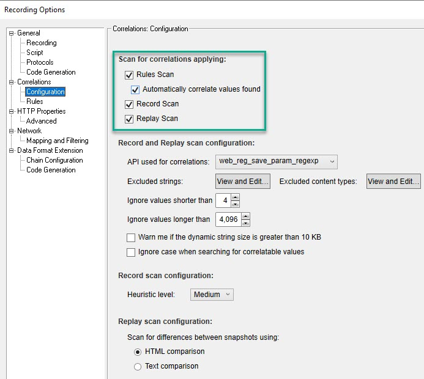

# Auto Correlation

For below exercises, please record the Pet Store business flow using the below settings.

* Browser: Internet Explorer
* Create an account at [https://petstore.octoperf.com/actions/Catalog.action](https://petstore.octoperf.com/actions/Catalog.action)
* Recording Options

|   **Steps to record**   | **Transaction Name**  |
|   ---------------   | ----------------  |
|   Launch [https://petstore.octoperf.com/actions/Catalog.action](https://petstore.octoperf.com/actions/Catalog.action)   |   T00_Launch  |
|   Click on Sign In   |   T10_SignIn |
|   Enter Username and Password and then click on `Login` |   T20_Login    |
|   Click on Fish |   T30_Fish  |
|   Click on first product ID |   T40_FishProductPage  |
|   Click on Add to Cart for the first product  |   T50_AddToCart   |
|   Click on Proceed to Checkout    |   T60_ProceedToCheckout   |
|   Click on Continue   |   T70_Payment |
|   Click on Confirm    |   T80_ConfirmOrder    |
|   Click on My Account |   T90_MyAccount   |
|   Click on My Orders  |   T100_MyOrders   |
|   Click on the order which you placed |   T110_OrderIDClick   |
|   Click on Sign Out   |   T120_SignOut    |

 

**00. How to auto correlate `jsessionid` in Pet Store script?**

Click here to view the hint/answer

 

Click on `Design Studio`, select the respective jsessionid `Text in response` and then click on `Correlate` button.

  

**10. How to undo auto correlation?**

Click here to view the hint/answer

 

Click on `Design Studio`, select the respective jsessionid `Text in response` and then click on `Undo Correlation` button.

  

**20. How to enable scan for correlation after recording?**

Click here to view the hint/answer

 

Go to `Record > Recording Options`, click on `Configuration` under `Correlations` and make sure the `Scan for correlations applying:` have been checked as shown below.

  

**30. How to change the default Correlation Parameter name while auto correlating?**

Click here to view the hint/answer

 

Click on `Design Studio`, select the respective jsessionid `Text in response` and then double click on the respective correlation parameter which will enable you to change the default parameter name.

  

**40. How to change the default Correlation Parameter name while auto correlating?**

Click here to view the hint/answer

 

Click on `Design Studio`, select the respective jsessionid and then double click on the respective correlation parameter which will enable you to change the default parameter name.

  

**50. How to create a rule for `jsession`?**

Click here to view the hint/answer

 

Click on `Design Studio`, select the respective jsessionid and then click on `Add as Rule`, enter a rule name and select the application from the drop down, and then click on OK to create a rule.

 

**60. How to add a string to the correlation exclusion list?**

Click here to view the hint/answer

 

Go to `Record > Recording Options`, click on `Configuration` under `Correlations`, click on `View and Edit` to add the string to the exclusion list.

  