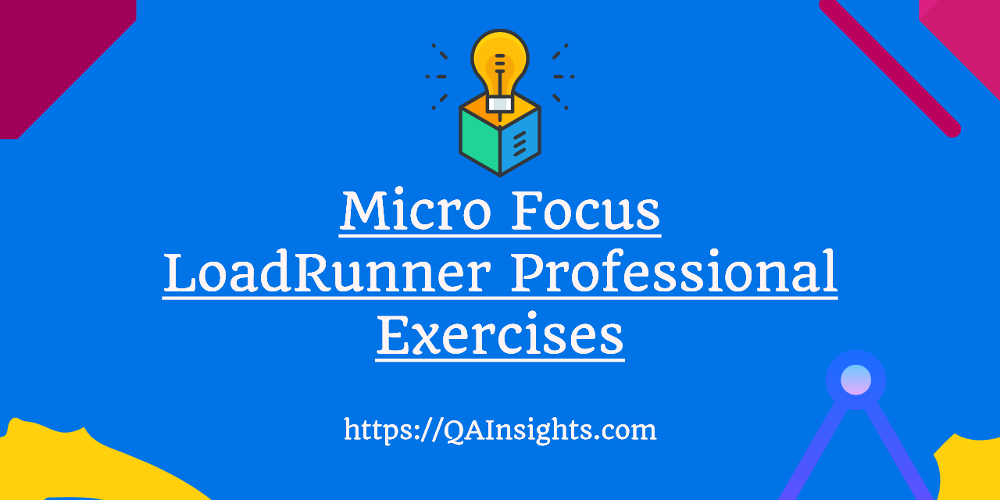

# LoadRunner Exercises

> Currently under active development.

|   **Exercise Navigation**    |
|   -----------------------    |
|   [Record and Replay](https://github.com/QAInsights/LoadRunner-Exercises/blob/master/00-Recording-Replay/00-Recording-Replay.md)   |
|   [Actions](https://github.com/QAInsights/LoadRunner-Exercises/blob/master/10-Actions/10-Actions.md)                               |
|   [Transactions](https://github.com/QAInsights/LoadRunner-Exercises/blob/master/20-Transactions/20-Transactions.md)                |   
|   [Regenerate Script](https://github.com/QAInsights/LoadRunner-Exercises/blob/master/30-Regenerate-Script/30-Regenerate.md)        |   
|   [Data Parameterization](https://github.com/QAInsights/LoadRunner-Exercises/blob/master/40-Data-Parameterization/40-Data-Parameterization.md)        |
|   [Pacing](https://github.com/QAInsights/LoadRunner-Exercises/blob/master/50-Pacing/50-Pacing.md)        |   
|   [Think Time](https://github.com/QAInsights/LoadRunner-Exercises/blob/master/60-ThinkTime/60-ThinkTime.md)        |   